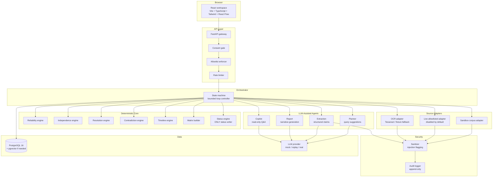
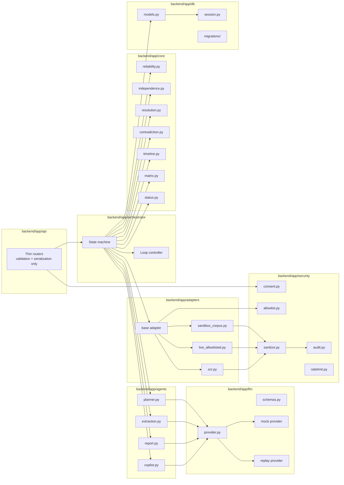
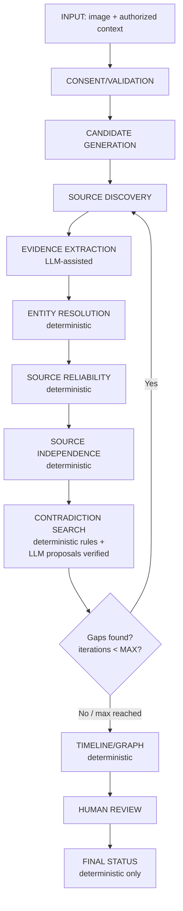
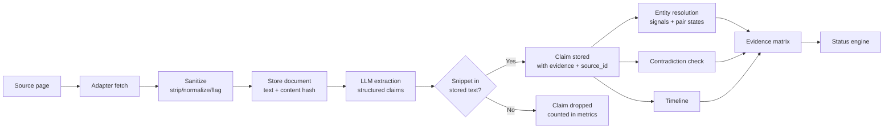
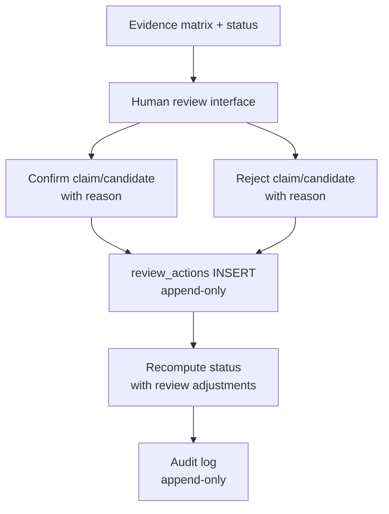

# TRACEID — Architecture

## High-level architecture



## Component diagram



## Pipeline with gap loop



## AI agent table

| Agent | Purpose | Input | Output schema | Method | Failure mode | Human-review trigger | Security controls |
|-------|---------|-------|--------------|--------|-------------|---------------------|-------------------|
| Identity Investigator | Orchestrator/planner | Case context, verified claims | QueryPlan(queries, target_domains) | LLM-assisted planning | Falls back to default query set | Never | Queries validated against allowlist |
| Profile Discovery | Source adapters + query | QueryPlan | RawDocument(url, text, metadata) | Adapter fetch + sanitize | Allowlist refusal logged; continue | Never | Allowlist enforced in base class; sanitizer strips injection |
| Entity Resolution | Deterministic scorer | Claims, signals | ResolutionResult(pair_state, signals) | Blocking + feature comparison | UNKNOWN if insufficient features | POSSIBLY_SAME triggers review | No LLM; pure functions |
| Evidence Extraction | LLM extraction + verification | Sanitized text | ExtractedClaim(entity, attr, value, snippet) | LLM structured output + snippet verification | Fail closed; drop unverifiable claims | Flagged documents highlighted | Randomized delimiters; schema-only output |
| Contradiction Detection | Rules over claims + LLM proposals | Structured claims | Contradiction(kind, hard/soft, evidence_ids) | Deterministic rules; LLM proposals verified | Conservative: uncertain = no contradiction | Hard contradiction flags case | LLM proposals verified against rules |
| Timeline | Deterministic ordering | Dated claims | TimelineEvent(date, claim, conflicts) | Date sorting + overlap detection | Missing dates → excluded, not guessed | Impossible timelines flagged | No LLM |
| Report | Template + LLM narrative | Matrix, status, evidence | ReportSection(text, evidence_ids) | Template with LLM narrative bound to evidence IDs | Deterministic-only fallback with banner | Always available | Strip uncited statements |
| Copilot | Read-only Q&A | User query + case evidence | CopilotAnswer(answer, evidence_ids, refused) | Retrieval + LLM answer with citations | Refuse out-of-scope; cite or refuse | Cannot trigger actions | Read-only; no fetches; no status changes |

## Evidence flow



## Verification and human-review flow



## Security boundaries (trust zones)

| Trust zone | Components | Trust level | Boundaries |
|-----------|-----------|-------------|-----------|
| Browser | React workspace | Untrusted | All input validated server-side; no secrets |
| API gateway | FastAPI, consent gate, rate limiter | Semi-trusted | Validates consent, enforces rate limits |
| Orchestrator | State machine, loop controller | Trusted | Controls pipeline flow; reads/writes via repositories |
| Deterministic core | reliability, independence, resolution, contradiction, timeline, matrix, status | Trusted | Pure functions; no network, no LLM, no DB |
| LLM-assisted agents | extraction, report, copilot, planner | Semi-trusted | Output schema-validated; fail closed; cannot write status |
| Source adapters | sandbox, live, OCR | Untrusted boundary | Allowlist enforced; output sanitized; no LLM or DB access |
| LLM provider | External API or mock/replay | Untrusted | Timeout; retry limits; structured output only |
| External content | Web pages, images | Untrusted | Data only; never instructions; sanitized; flagged |
| Database | PostgreSQL | Trusted | Constraints enforce evidence-first; audit append-only |

## Pluggable source-adapter interface

```python
class BaseAdapter(ABC):
    def __init__(self, allowlist: AllowlistConfig, audit: AuditLogger):
        self._allowlist = allowlist
        self._audit = audit

    def fetch(self, source_ref: SourceRef) -> RawDocument:
        if not self._allowlist.is_allowed(source_ref.domain):
            self._audit.log_refusal(source_ref)
            raise AllowlistRefusalError(source_ref.domain)
        return self._do_fetch(source_ref)

    @abstractmethod
    def _do_fetch(self, source_ref: SourceRef) -> RawDocument: ...
```

Adapters return raw documents only. They never call the LLM and never write to the DB. Allowlist enforcement is in the base class, not in callers.

## Deployment

```yaml
# docker-compose.yml
services:
  db:
    image: pgvector/pgvector:pg16  # pgvector only if embeddings used
    healthcheck:
      test: ["CMD-SHELL", "pg_isready -U traceid"]
    volumes:
      - pgdata:/var/lib/postgresql/data
  backend:
    build: ./backend
    depends_on:
      db: { condition: service_healthy }
    env_file: .env
  frontend:
    build: ./frontend
    depends_on: [backend]
volumes:
  pgdata:
```

## MVP build order

1. **P0**: Scaffold (repo layout, Docker, health endpoint, Makefile, frontend skeleton)
2. **P1**: Database (SQLAlchemy models, Alembic migrations, constraints)
3. **P2** ∥ **P3**: Core engines (pure functions) ∥ Sandbox corpus + adapters + sanitizer
4. **P4**: LLM layer (extraction, report, copilot with fail-closed contracts)
5. **P5**: Orchestrator state machine + API endpoints
6. **P6**: Frontend (React workspace with all panels)
7. **P7**: Demo hardening, doc sync, replay fixtures, freeze
