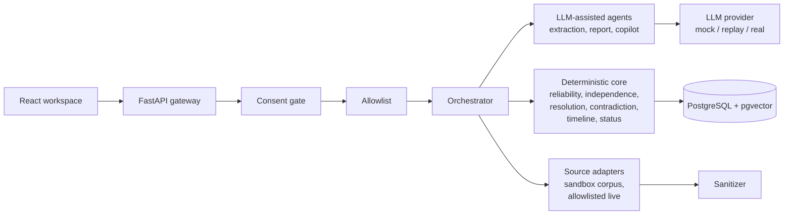

# TRACEID — Evidence-Based Digital Identity Intelligence

> An evidence-first, explainable, multi-agent digital identity intelligence platform.

TRACEID analyzes an organizer-provided, consented image and limited authorized context to discover, correlate, and verify publicly available information associated with an identified person. It does not identify a person at any cost — it determines whether authorized public evidence is sufficient to establish a likely digital identity. **Insufficient evidence is a first-class outcome.**

Built for NEURAX Hackathon 3.0, Domain 3 — AI in Cybersecurity.

---

## Problem understanding

Naive identity discovery fails because the real world is adversarial and ambiguous:

- **False matches**: common names produce multiple plausible candidates with no separating evidence
- **Copied content**: mirrors, syndication, and scrapers create the illusion of independent confirmation
- **Namesakes**: distinct people share names, usernames, employers, and even publication topics
- **Poisoned sources**: fake profiles, backdated pages, and injected instructions attempt to mislead automated systems
- **Privacy harm**: over-confident identification can damage innocent people; "unknown" must be a valid answer

The official problem: build a software-only AI system that analyzes an organizer-provided, consented image and limited authorized context to discover, correlate, and verify publicly available information associated with the identified person.

## Why common approaches fail

| Approach | Why it fails | How TRACEID differs |
|----------|-------------|-------------------|
| Generic scraper | No provenance; copied content inflates confidence | Source independence clusters count origins, not URLs |
| Reverse-image-search clone | Image alone is insufficient; privacy risk | Image used only for OCR/context extraction, not open-web face search |
| Single LLM prompt | Hallucination, no audit trail, not explainable | LLM assists extraction only; status is deterministic and auditable |
| URL aggregator | No verification; lists are not evidence | Every claim traces to a verbatim snippet with provenance |
| Unexplained confidence score | Fake mathematical certainty | Interpretable evidence matrix (supporting/contradicting/unresolved), no single percentage |
| Face-recognition-only | Privacy violation; unreliable at scale | Face similarity off by default; never sufficient alone |

## Differentiators

1. **Evidence-first architecture** — every claim traces to a stored, verbatim source snippet
2. **Source independence detection** — copies of one claim form one cluster; count clusters, not URLs
3. **Deterministic status engine** — LLM never decides the verdict; rules are auditable and configurable
4. **Contradiction-before-status** — disconfirming evidence is actively hunted before any match is declared
5. **Interpretable evidence matrix** — supporting/contradicting/unresolved signals with tiers, not a single score
6. **INSUFFICIENT EVIDENCE as first-class outcome** — the system never fabricates an identity
7. **Prompt-injection defense** — layered sanitization; web content is data, never instructions
8. **Bounded investigation loop** — discover → extract → resolve → contradict → re-discover if gaps remain
9. **Human-in-the-loop review** — confirm/reject claims with logged reasons; evidence is never deleted
10. **Offline demo capability** — record/replay mode with zero network dependency

## Architecture

**Pipeline**: INPUT → CONSENT/VALIDATION → CANDIDATE GENERATION → SOURCE DISCOVERY → EVIDENCE EXTRACTION → ENTITY RESOLUTION → SOURCE RELIABILITY → SOURCE INDEPENDENCE → CONTRADICTION SEARCH → (gap loop, max N iterations) → TIMELINE/GRAPH → HUMAN REVIEW → FINAL STATUS

## Where AI belongs

| Stage | Method | Rationale |
|-------|--------|-----------|
| Query planning suggestions | LLM-assisted | Creative search strategy from authorized context |
| Evidence extraction | LLM-assisted | Structured claim extraction from text |
| Contradiction proposals | LLM-assisted | Candidate contradictions verified by deterministic rules |
| Report narrative | LLM-assisted | Natural language bound to evidence IDs |
| Copilot Q&A | LLM-assisted | Read-only, cited answers over case evidence |
| Source reliability | Deterministic | Tier rubric with configurable rules |
| Source independence | Deterministic | Layered clustering algorithm |
| Entity resolution | Deterministic + optional embeddings | Feature comparison with typed signals |
| Contradiction rules | Deterministic | Structured claims over rules |
| Timeline ordering | Deterministic | Date-based ordering and overlap detection |
| **Final status** | **Deterministic** | **The LLM never issues the verdict** |

## Evidence-first model and source independence

Every reportable claim requires a stored verbatim snippet from a fetched source with provenance (source type, reliability tier, timestamps). Sources that copy each other are detected via:

1. Same owner/canonical domain → one cluster
2. Near-duplicate content (shingling/MinHash) → derived
3. Attribution/"via" links → derived
4. Earliest publication → candidate origin

**Example**: Website A publishes a biography. B and C copy it verbatim. All three form **one independence cluster** — one confirmation, not three.

## Decision model

**Pair states** (entity resolution): SAME · POSSIBLY_SAME · DIFFERENT · UNKNOWN.

**Case statuses**: STRONG MATCH · POSSIBLE MATCH · AMBIGUOUS · INSUFFICIENT EVIDENCE · LIKELY DIFFERENT.

Decisions use an interpretable evidence matrix — supporting, contradicting, and unresolved signals organized by signal tier (DISCRIMINATING, CORROBORATING, WEAK), reliability tier (HIGH, MEDIUM, LOW), and independence cluster. No single confidence percentage.

## Security, privacy, and responsible design

- **Consent gate**: explicit consent required before any processing
- **Approved-source allowlist**: only organizer-approved domains; refusals audited
- **Public/synthetic data only**: no private accounts, leaked data, credentials, or bypass
- **Webpages as untrusted data**: content never reaches tool selection or status logic
- **Image handling (D2)**: EXIF stripped; OCR output sanitized; no open-web face search; face similarity off by default, never sufficient alone
- **Data minimization and retention**: `expires_at` on all case data; deletion endpoint
- **Audit logging**: append-only; every action recorded
- **Human review**: confirm/reject with logged reason; evidence is never deleted

See [THREAT_MODEL.md](THREAT_MODEL.md) for the complete threat table and misuse analysis.

## Demo scenarios (synthetic data, 3–5 minutes)

| Scenario | Input | Judge sees | Proves |
|----------|-------|-----------|--------|
| A — Strong Match | "Aarav Mehta", institution, event | STRONG MATCH with mutual links, mirror copies counted once | Evidence-first with independence |
| B — Ambiguous | "Priya Nair", name + event only | AMBIGUOUS with two candidates side by side | System doesn't guess when evidence is tied |
| C — No Footprint | Sparse context | INSUFFICIENT EVIDENCE with "what was checked" | Unknown is a valid, intentional outcome |

## MVP vs roadmap

**MVP**: sandbox corpus, deterministic core, mock/replay LLM, React workspace, PostgreSQL, offline demo. See [FUTURE_ROADMAP.md](FUTURE_ROADMAP.md) for post-hackathon items (Neo4j graph, live adapters, multi-language extraction, calibrated thresholds).

**Not used**: Neo4j (roadmap; PostgreSQL edge tables suffice for MVP), Redis (no caching layer needed), Kafka (no event streaming), face recognition for discovery (privacy violation).

## Documentation index

| Document | Purpose |
|----------|---------|
| [RESEARCH.md](RESEARCH.md) | Established concepts and verified sources |
| [ARCHITECTURE.md](ARCHITECTURE.md) | Components, diagrams, pipeline, agent table |
| [CONFIGURATION.md](CONFIGURATION.md) | Every tunable parameter |
| [RESEARCH_NOTES.md](RESEARCH_NOTES.md) | Decision log, alternatives, open questions |
| [THREAT_MODEL.md](THREAT_MODEL.md) | Threat table and misuse analysis |
| [DATA_MODEL.md](DATA_MODEL.md) | DDL, graph design, constraints, ER diagram |
| [API_SPEC.md](API_SPEC.md) | REST endpoints for MVP |
| [DEMO_PLAN.md](DEMO_PLAN.md) | 3–5 minute demo script |
| [JUDGING_MATRIX.md](JUDGING_MATRIX.md) | Criteria → evidence → where demonstrated |
| [PROJECT_STRUCTURE.md](PROJECT_STRUCTURE.md) | Repository layout |
| [FUTURE_ROADMAP.md](FUTURE_ROADMAP.md) | Post-hackathon items |
| [.env.example](.env.example) | Environment variable placeholders |

## Scoring map

| README section | Criterion |
|----------------|-----------|
| Problem understanding, common approaches, differentiators | Problem Understanding (5) |
| Architecture, pipeline, where AI belongs, data model | Architecture (5) |
| Evidence model, decision model, contradiction, independence, security | Approach (5) |

## Honest limitations

- Synthetic corpus only; thresholds tuned on synthetic data, not calibrated as probabilities
- English-language extraction only in MVP
- Single LLM provider; no model ensemble or fallback chain beyond retry
- Source independence heuristics may over- or under-merge on edge cases
- Human review is designed but not load-tested for scale
- No real-time monitoring or alerting in MVP
